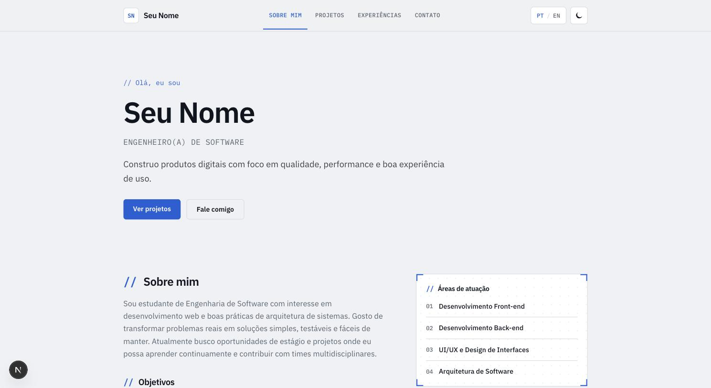
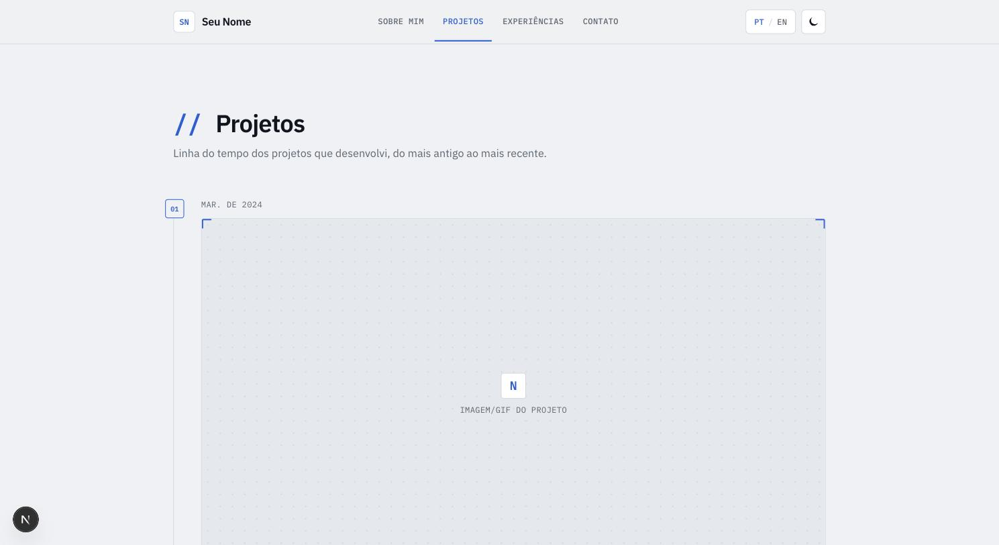
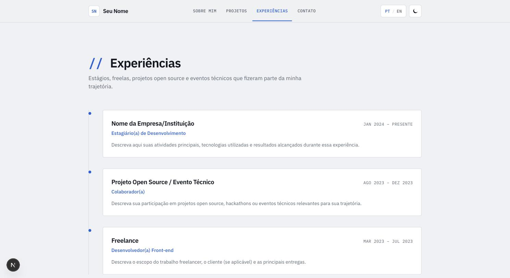
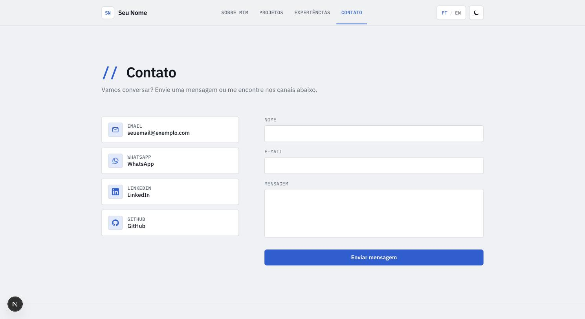

# Portfólio Profissional

Website de portfólio profissional desenvolvido para o Laboratório 1 — Projeto de Software (PUC Minas, Engenharia de Software, 2º semestre/2026). Site bilíngue (PT/EN), responsivo, com seções de Sobre Mim, Projetos, Experiências e Contato (com envio de e-mail via back-end próprio).

> 🔗 **Site publicado:** `<< adicionar link da hospedagem aqui após o deploy >>`

## Sumário

- [Checklist da entrega (Laboratório 1)](#checklist-da-entrega-laboratório-1)
- [Capturas de tela](#capturas-de-tela)
- [Tecnologias utilizadas](#tecnologias-utilizadas)
- [Dependências e bibliotecas](#dependências-e-bibliotecas)
- [Estrutura de diretórios](#estrutura-de-diretórios)
- [Como rodar localmente](#como-rodar-localmente)
- [Configuração do formulário de contato](#configuração-do-formulário-de-contato)
- [Deploy](#deploy)
- [Personalizando este modelo](#personalizando-este-modelo)

## Checklist da entrega (Laboratório 1)

| Item | Status |
| --- | --- |
| Criação do repositório GitHub com README inicial | ✅ Feito |
| Wireframes das páginas no Figma (média fidelidade) | ⬜ Pendente — adicionar link do Figma aqui |
| Protótipo inicial do front-end (Next.js/React + Tailwind CSS) | ✅ Feito |
| Implementação da navegação (estrutura de páginas e links entre seções) | ✅ Feito — ver [Header](./src/components/header.tsx) |
| Layout principal (cabeçalho, rodapé e área de conteúdo) | ✅ Feito — ver [capturas de tela](#capturas-de-tela) abaixo |

> ⚠️ Falta apenas anexar o link dos wireframes do Figma antes de enviar esta entrega.

## Capturas de tela

| Sobre mim | Projetos |
| --- | --- |
|  |  |

| Experiências | Contato |
| --- | --- |
|  |  |

## Tecnologias utilizadas

- **[Next.js 16](https://nextjs.org/)** (App Router) — framework React fullstack, usado tanto para o front-end quanto para o back-end (API Route de contato).
- **[React 19](https://react.dev/)** — biblioteca de UI.
- **[TypeScript](https://www.typescriptlang.org/)** — tipagem estática.
- **[Tailwind CSS 4](https://tailwindcss.com/)** — estilização utilitária, tema claro/escuro e responsividade.
- **[Resend](https://resend.com/)** — envio de e-mails a partir da API Route `/api/contact` (back-end).

## Dependências e bibliotecas

| Pacote | Tipo | Finalidade |
| --- | --- | --- |
| `next` | dependência | Framework (roteamento, SSR, API routes) |
| `react` / `react-dom` | dependência | Biblioteca de UI |
| `resend` | dependência | Cliente para envio de e-mails no back-end |
| `typescript` | devDependency | Tipagem estática |
| `tailwindcss` / `@tailwindcss/postcss` | devDependency | Estilização |
| `eslint` / `eslint-config-next` | devDependency | Lint de código |
| `@types/*` | devDependency | Tipos para Node e React |

Lista completa e versões exatas em [`package.json`](./package.json).

## Estrutura de diretórios

```
portifolio_modelo/
├── public/
│   └── images/projects/     # imagens/GIFs dos projetos (adicione os seus aqui)
├── src/
│   ├── app/
│   │   ├── layout.tsx        # layout raiz (fontes, providers, header, footer)
│   │   ├── page.tsx           # página "Sobre Mim" (rota "/")
│   │   ├── globals.css        # tema (cores, dark mode) e estilos globais
│   │   ├── projetos/
│   │   │   └── page.tsx       # página "Projetos" (timeline)
│   │   ├── experiencias/
│   │   │   └── page.tsx       # página "Experiências"
│   │   ├── contato/
│   │   │   └── page.tsx       # página "Contato" (ícones + formulário)
│   │   └── api/
│   │       └── contact/
│   │           └── route.ts   # back-end: recebe o form e envia e-mail via Resend
│   ├── components/            # componentes de UI reutilizáveis (Header, Footer, ícones, form...)
│   ├── context/                # Context API: idioma (PT/EN) e tema (claro/escuro)
│   ├── data/                   # conteúdo do site: textos (i18n), projetos e experiências
│   └── lib/                    # tipos e funções utilitárias (formatação de datas, etc.)
├── .env.example                 # variáveis de ambiente necessárias (copiar para .env.local)
└── package.json
```

## Como rodar localmente

Pré-requisitos: [Node.js 20+](https://nodejs.org/) e npm.

```bash
# 1. Clonar o repositório
git clone <url-do-seu-repositorio>
cd portifolio_modelo

# 2. Instalar as dependências
npm install

# 3. Configurar variáveis de ambiente (opcional, necessário só para o formulário de contato)
cp .env.example .env.local
# edite .env.local com sua RESEND_API_KEY e CONTACT_EMAIL_TO

# 4. Rodar o servidor de desenvolvimento
npm run dev
```

O site estará disponível em [http://localhost:3000](http://localhost:3000).

Outros scripts disponíveis:

```bash
npm run build   # build de produção
npm run start   # roda o build de produção localmente
npm run lint    # checagem de lint
```

## Configuração do formulário de contato

O formulário da página **Contato** envia os dados para a API Route `src/app/api/contact/route.ts`, que usa o [Resend](https://resend.com/) para disparar um e-mail. Para funcionar:

1. Crie uma conta gratuita em [resend.com](https://resend.com/) e gere uma API key.
2. No `.env.local` (local) ou nas variáveis de ambiente do serviço de hospedagem (produção), defina:
   - `RESEND_API_KEY` — sua chave de API do Resend.
   - `CONTACT_EMAIL_TO` — o e-mail que deve receber as mensagens.
3. Sem essas variáveis configuradas, o formulário exibe uma mensagem de erro amigável (o restante do site continua funcionando normalmente, e os ícones de contato direto — e-mail, WhatsApp, LinkedIn, GitHub — seguem funcionando).

## Deploy

Este projeto pode ser publicado gratuitamente em qualquer serviço com suporte a Next.js, como [Vercel](https://vercel.com/), [Render](https://render.com/) ou [Fly.io](https://fly.io/):

1. Suba o repositório para o GitHub.
2. Importe o projeto no serviço escolhido.
3. Configure as variáveis de ambiente `RESEND_API_KEY` e `CONTACT_EMAIL_TO`.
4. Faça o deploy e atualize o link no topo deste README.

## Personalizando este modelo

Este repositório foi estruturado como um **modelo** de portfólio. Para adaptar aos seus dados:

- `src/data/content.ts` — nome, cargo, e-mail, WhatsApp, LinkedIn, GitHub e todos os textos (PT/EN) do site.
- `src/data/projects.ts` — seus projetos (nome, descrição, tecnologias, link do repositório, data).
- `src/data/experiences.ts` — suas experiências profissionais/acadêmicas.
- `public/images/projects/` — imagens ou GIFs dos projetos em funcionamento; referencie o caminho no campo `image` de cada projeto em `projects.ts`.
